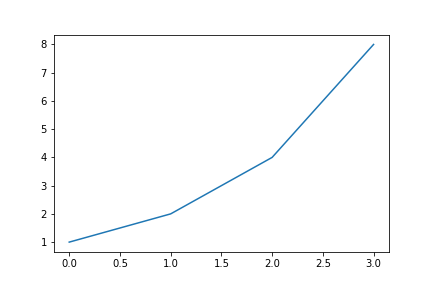

# Table of Contents

1.  [Headings](#org6e18699)
    1.  [subheading](#orgf113fdf)
        1.  [subsubheading](#orgf62be08)
2.  [Markups](#orgf17a261)
3.  [Lists](#org44c8231)
    1.  [Numbered lists](#orgd2e64cb)
    2.  [plain lists](#org154a774)
    3.  [checklists](#org265d28a)
    4.  [definition lists](#org3e28980)
4.  [Equations](#org84df550)
5.  [Code blocks](#org8e8819e)
6.  [Figures](#orge304757)
    1.  [another figure](#org1a12a86)
7.  [Tables](#orgac5f7b8)
8.  [Citations  label:sec-citations](#org1baf832)
9.  [Radio targets](#org7533811)
10. [Cross-references](#org4d33ec8)
11. [Custom links?](#org17f83dc)
12. [Exporting a single file](#orgffef85b)
13. [Handling projects](#org3bf77c2)
14. [Downsides to this approach](#org57446c9)

Why? Don't we already have org-mode? Yes, but some places like Markdown, it is no fun to write when you have really technical documents, and it would be harder to get markdown-mode to be as good as org-mode than to do this.

Github's rendering of org-mode is only ok. Too many things like references, internal links, etc. don't work though to rely on it for high quality documentation in the browser. This might be a nicer way to get better Github pages. Why not just use html then? Some places like markdown.


<a id="org6e18699"></a>

# Headings

It goes without saying I hope, that we use headings to organize things.


<a id="orgf113fdf"></a>

## subheading


<a id="orgf62be08"></a>

### subsubheading

Anything deeper than this gets turned into paragraphs by default.


<a id="orgf17a261"></a>

# Markups

**bold** *italics* <span class="underline">underline</span> <del>strike</del> `verbatim` `code`

subscripts: H<sub>2</sub>O

superscripts: H<sup>+</sup>

Regular urls are fine: <http://google.com>.


<a id="org44c8231"></a>

# Lists


<a id="orgd2e64cb"></a>

## Numbered lists

1.  one
2.  two
3.  three

Note these letters will render as numbers.

1.  apple
2.  bear
3.  cat


<a id="org154a774"></a>

## plain lists

-   one
-   two
-   three
    -   with nesting
        -   deeper
    -   back in
-   all the way


<a id="org265d28a"></a>

## checklists

-   [ ] one
-   [ ] two
-   [ ] three


<a id="org3e28980"></a>

## definition lists

-   **org-mode:** what makes this possible
-   **emacs:** the other thing you need


<a id="org84df550"></a>

# Equations

Suppose you have this equation to solve:

\[8 = x - 4\]  <a name="eq-sle"></a>

You can put a label near this and refer to it later. I guess Github does not do a great job rendering equations.


<a id="org8e8819e"></a>

# Code blocks

You can put code right into your org file, and run it. The code and results show in the markdown export.

```ipython
%matplotlib inline
import matplotlib.pyplot as plt

print(8 - 4)

plt.plot([1, 2, 4, 8])
plt.savefig('geometric.png')

```

    4


```ipython
%matplotlib inline
import matplotlib.pyplot as plt

print(8 - 4)

plt.plot([1, 2, 4, 8])
plt.savefig('geometric.png')

```


<a id="orge304757"></a>

# Figures

You might like a caption with a label you can refer to later. The figures aren't numbered; instead the labels are used. It seems possible to get numbering, but it would take some work.


<figure>
  
  <figcaption>Figure (fig-data): A figure with a  caption. <a name="fig-data"></a></figcaption>
</figure>


<a id="org1a12a86"></a>

## another figure


<figure>
  
  <figcaption>Figure (fig-data-2): Another figure to check numbering. <a name="fig-data-2"></a></figcaption>
</figure>


<a id="orgac5f7b8"></a>

# Tables

You can have tables, with captions and labels.

<table border="2" cellspacing="0" cellpadding="6" rules="groups" frame="hsides">
<caption class="t-above"><span class="table-number">Table 1:</span> A data table. <a name="tab-data"></a></caption>

<colgroup>
<col  class="org-right" />

<col  class="org-right" />
</colgroup>
<thead>
<tr>
<th scope="col" class="org-right">x</th>
<th scope="col" class="org-right">y</th>
</tr>
</thead>

<tbody>
<tr>
<td class="org-right">1</td>
<td class="org-right">1</td>
</tr>


<tr>
<td class="org-right">2</td>
<td class="org-right">4</td>
</tr>


<tr>
<td class="org-right">3</td>
<td class="org-right">9</td>
</tr>


<tr>
<td class="org-right">4</td>
<td class="org-right">16</td>
</tr>
</tbody>
</table>

Here is another table:

<table border="2" cellspacing="0" cellpadding="6" rules="groups" frame="hsides">
<caption class="t-above"><span class="table-number">Table 2:</span> A count of categories. <a name="tab-cat"></a></caption>

<colgroup>
<col  class="org-left" />

<col  class="org-right" />
</colgroup>
<thead>
<tr>
<th scope="col" class="org-left">category</th>
<th scope="col" class="org-right">count</th>
</tr>
</thead>

<tbody>
<tr>
<td class="org-left">apples</td>
<td class="org-right">2</td>
</tr>


<tr>
<td class="org-left">oranges</td>
<td class="org-right">4</td>
</tr>
</tbody>
</table>

Tables are numbered in the export, but they export as html, and it is the org-html exporter taking care of this.


<a id="org1baf832"></a>

# Citations  <a name="sec-citations"></a>

You can have proper scientific citations like this <sup id="9e3ad98c9008c49c9d14834ca3913eb6"><a href="#kitchin-2015-examp" title="Kitchin, Examples of Effective Data Sharing in Scientific Publishing, {ACS Catalysis}, v(6), 3894-3899 (2015).">kitchin-2015-examp</a></sup>, including multiple references <sup id="66b54b1976758a93506a846c2666419b"><a href="#kitchin-2015-data-surfac-scien" title="John Kitchin, Data Sharing in Surface Science, Surface Science , v(), 103-107 (2016).">kitchin-2015-data-surfac-scien</a></sup><sup>,</sup><sup id="9e3ad98c9008c49c9d14834ca3913eb6"><a href="#kitchin-2015-examp" title="Kitchin, Examples of Effective Data Sharing in Scientific Publishing, {ACS Catalysis}, v(6), 3894-3899 (2015).">kitchin-2015-examp</a></sup><sup>,</sup><sup id="fe4ece7c7b3687ca21f32c0ee4e0a542"><a href="#kitchin-2016-autom-data" title="Kitchin, Van Gulick \&amp; Zilinski, Automating Data Sharing Through Authoring Tools, International Journal on Digital Libraries, v(2), 93--98 (2016).">kitchin-2016-autom-data</a></sup>. Check out the tooltips on them in the html that Github renders. Somewhat unfortunately, the citations are exported basically as html, so they are not fun to read in the markdown. Oh well, did I mention tooltips!

org-ref helps you insert citations from a bibtex database.

It is conceivable to have numbered citations, and fancier formatting, but I have no plans to implement that.


<a id="org7533811"></a>

# Radio targets

In org-mode you can define a <a name="target"></a>target that you can make a link to later.


<a id="org4d33ec8"></a>

# Cross-references

Remember Table [tab-data](#tab-data) or the category Table ([tab-cat](#tab-cat))?   Or that figure we put a caption on (Fig.  [fig-data](#fig-data)).

How about section [sec-citations](#sec-citations) on citations?

Remember the [target](#target) we referred to earlier?

What matters the most in cross-references is that org-ref helps you complete them.

```ipython
print(f'x = {8 + 4}')

```

    x = 12

The results above show the answer to Eq. [eq-sle](#eq-sle).


<a id="org17f83dc"></a>

# Custom links?

No problem, just define an exporter for markdown. How about a youtube link? On export, we will replace the link with an html iframe.

```emacs-lisp
(org-link-set-parameters
 "youtube"
 :follow (lambda (path)
	   (browse-url (format "https://youtu.be/%s" path)))
 :export (lambda (path desc backend)
	   (cond
	    ((eq 'md backend)
	     (format "[%s](%s)

<a href=\"https://www.youtube.com/watch?v=%s\">
</a>"
		     (or desc (format "https://youtu.be/%s" path))
		     (format "https://youtu.be/%s" path)
		     path path))))
 :help-echo "A youtube video. Click to open in browser.")

```

Checkout youtube:fgizHHd7nOo


<a id="orgffef85b"></a>

# Exporting a single file

```emacs-lisp
(require 'scimax-md)

```

    scimax-md

To a buffer:

```emacs-lisp
(pop-to-buffer (org-export-to-buffer 'scimax-md "*scimax-md-export*"))

```

    #<buffer *scimax-md-export*>

```emacs-lisp
(require 'scimax-md)
(org-export-to-file 'scimax-md "scimax-md.md")

```

    scimax-md.md

# Bibliography
<a id="kitchin-2015-examp">[kitchin-2015-examp]</a> Kitchin, Examples of Effective Data Sharing in Scientific Publishing, <i>{ACS Catalysis}</i>, <b>5(6)</b>, 3894-3899 (2015). <a href=" http://dx.doi.org/10.1021/acscatal.5b00538 ">link</a>. <a href="http://dx.doi.org/10.1021/acscatal.5b00538">doi</a>. [↩](#9e3ad98c9008c49c9d14834ca3913eb6)

<a id="kitchin-2015-data-surfac-scien">[kitchin-2015-data-surfac-scien]</a> "John Kitchin", Data Sharing in Surface Science, <i>"Surface Science "</i>, <b>647()</b>, 103-107 (2016). <a href="http://www.sciencedirect.com/science/article/pii/S0039602815001326">link</a>. <a href="http://dx.doi.org/10.1016/j.susc.2015.05.007">doi</a>. [↩](#66b54b1976758a93506a846c2666419b)

<a id="kitchin-2016-autom-data">[kitchin-2016-autom-data]</a> "Kitchin, Van Gulick \& Zilinski, Automating Data Sharing Through Authoring Tools, <i>"International Journal on Digital Libraries"</i>, <b>18(2)</b>, 93--98 (2016). <a href="http://dx.doi.org/10.1007/s00799-016-0173-7">link</a>. <a href="http://dx.doi.org/10.1007/s00799-016-0173-7">doi</a>. [↩](#fe4ece7c7b3687ca21f32c0ee4e0a542)


<a id="org3bf77c2"></a>

# Handling projects

Your project might have many org files that should all be published. No problem. First, setup your project, e.g.

```emacs-lisp
(setq org-publish-project-alist
      '(("scimax-md"
         :base-directory "/Users/jkitchin/vc/jkitchin-github/scimax/scimax-md/"
         :publishing-directory "/Users/jkitchin/vc/jkitchin-github/scimax/scimax-md/"
         :publishing-function scimax-md-publish-to-md)))

(require 'scimax-md)
(org-publish "scimax-md" t)

```

Now, we can test a link to another file:

1.  A bare file link:  [./ideas.md](./ideas.md).
2.  A file link with description  [ideas](./ideas.md).


<a id="org57446c9"></a>

# Downsides to this approach

I never read or edit the markdown that is produced. There is probably a lot of stuff in it you would never write yourself. If that is a problem, there is a lot to do to get rid of it. Especially the way I use html to get features might not be considered very standard. Others might not want to read it or edit it.

Here are some org-generated lines:

    <a id="org0d027ad"></a>

This `You can have proper scientific citations like this cite:kitchin-2015-examp,` expanded to this:

    You can have proper scientific citations like this <sup id="9e3ad98c9008c49c9d14834ca3913eb6"><a href="#kitchin-2015-examp" title="Kitchin, Examples of Effective Data Sharing in Scientific Publishing, {ACS Catalysis}, v(6), 3894-3899 (2015).">kitchin-2015-examp</a></sup>,

You can see the citations are basically just html. They look good when rendered, but are kind of irritating to read in markdown. Not a problem in org-mode&#x2026;

This is a one way conversion. If someone edits the markdown, and you re-export, you will clobber their changes. This isn't a big deal with version control, but could cause some issues. I don't forsee a markdown parser and converter to org-mode.

Some ids are randomly generated. This may make version control a little irritating, as there will always be nuisance changes.

Not every corner of org-mode has been tested yet. Might as well try one more thing:

> emacs outshines all other editing software in approximately the same way that the noonday sun does the stars. It is not just bigger and brighter; it simply makes everything else vanish. Neal Stephenson, In the Beginning was the Command Line (1998)
